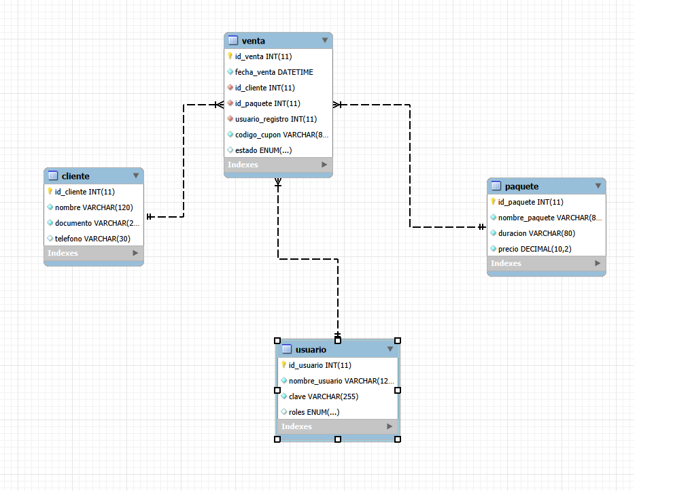
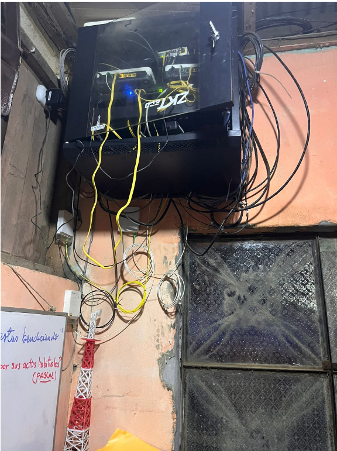
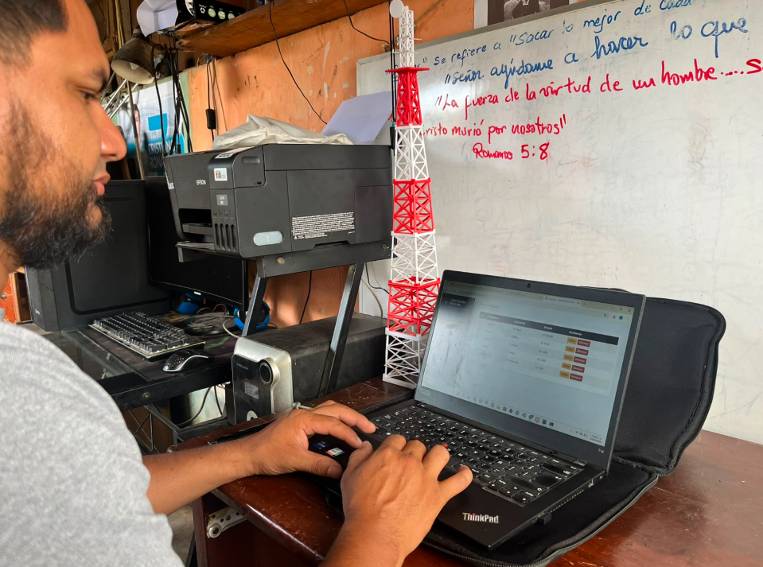

# Sistema de Gestión de Servicios de Internet – LBNETWORK

Aplicación web para el registro y gestión de ventas de paquetes de internet Wifi, desarrollada en **PHP puro con arquitectura MVC desde cero**, **programación orientada a objetos**, **PDO** y **MariaDB / MySQL** como base de datos.

---

## Descripción del negocio

**Nombre:** LBNETWORK S.R.L  
**RUC:** 20611412925  
**Giro:** Telecomunicaciones – Servicio de Internet  
**Tamaño:** Pequeña empresa  

Empresa dedicada a brindar servicio de internet residencial en hogares, ofreciendo diferentes planes según la velocidad. Realiza instalaciones, gestiona pagos mensuales y brinda soporte técnico ante fallas del servicio.

---

## Problemática

El registro de ventas para clientes suele realizarse de manera poco organizada, lo que dificulta llevar un control claro de los paquetes vendidos, los clientes atendidos y los códigos entregados. Esta falta de orden puede generar errores en el cobro, duplicidad de registros, pérdida de información y un manejo ineficiente del servicio, especialmente cuando hay alta demanda. Además, al no contar con una herramienta visual e intuitiva, el proceso puede volverse confuso tanto para el personal como para los clientes.

---

## Solución

Desarrollar una plataforma web orientada al registro de la venta de paquetes para clientes, permitiendo un mejor manejo y control de cada transacción realizada. El sistema ofrece una interfaz intuitiva y responsive, facilitando la navegación desde distintos dispositivos y mejorando la experiencia de uso. Con ello, se podrá registrar de forma ordenada cada venta, consultar los paquetes disponibles, administrar clientes y controlar los usuarios que registran la información.

---

## Requerimientos Funcionales

| Código | Descripción |
|---|---|
| RF01 | El sistema debe registrar clientes nuevos |
| RF02 | El sistema debe guardar los datos personales del cliente |
| RF03 | El sistema debe registrar los planes de internet disponibles |
| RF04 | El sistema debe asignar un plan de internet a un cliente |
| RF05 | El sistema debe registrar la instalación del servicio en el domicilio del cliente |
| RF06 | El sistema debe registrar los pagos mensuales del servicio |
| RF07 | El sistema debe consultar el historial de pagos de los clientes |
| RF08 | El sistema debe registrar solicitudes de soporte técnico |
| RF09 | El sistema debe mostrar los servicios activos de los clientes |
| RF10 | El sistema debe generar reportes de clientes y pagos |

---

## Requerimientos No Funcionales

| Código | Tipo | Descripción |
|---|---|---|
| RNF01 | Seguridad | Acceso mediante usuario y contraseña |
| RNF02 | Seguridad | Protección de datos de clientes |
| RNF03 | Rendimiento | Tiempo de respuesta menor a 5 segundos |
| RNF04 | Acceso | Solo personal autorizado |
| RNF05 | Respaldo | Copias de seguridad de la base de datos |
| RNF06 | Usabilidad | Interfaz fácil de usar |
| RNF07 | Disponibilidad | Sistema disponible para consultas administrativas |

---

## Alcance

- Login y cierre de sesión
- Dashboard con resumen general
- CRUD de paquetes
- CRUD de clientes
- CRUD de usuarios
- Registro de ventas
- Landing page informativa
- Tabla de paquetes, duración y precios

---

## Stack

| Capa | Tecnología |
|---|---|
| Backend | PHP 8+ |
| Base de datos | MariaDB / MySQL |
| Frontend | HTML5, CSS3, JavaScript, Bootstrap |
| Iconos | Font Awesome |
| Fuente | Poppins |
| Arquitectura | MVC desde cero |

---

## Arquitectura

El proyecto está organizado bajo el patrón **MVC**:

- `Controllers` procesan las peticiones
- `Models` se conectan a la base de datos
- `Views` muestran la interfaz al usuario

La navegación se maneja con sesiones PHP para proteger las rutas privadas del panel administrativo.

---

## Flujo del sistema

1. El usuario ingresa a la landing page o al login
2. El sistema valida credenciales
3. Si la sesión es correcta, se redirige al dashboard
4. Desde el panel se administran paquetes, clientes, usuarios y ventas
5. Al cerrar sesión, se elimina la sesión y se redirige a la página principal

---

## Estructura del proyecto

```text
daniel/
|-- app/
|   |-- config/
|   |-- controllers/
|   |-- core/
|   |-- models/
|   |-- views/
|-- public/
|   |-- css/
|   |-- js/
|   |-- img/
|   |-- video/
|-- database.sql
|-- .env
|-- README.md
```

---
### DIAGRAMA DE FIGMA
Más info en [Mi_Diseño_Figma](https://www.figma.com/design/n0jyJFqX0S9NUUc56IJL1f/Sin-t%C3%ADtulo?node-id=26-1742&t=nF7zlaAGr2diey0k-1)
### DIAGRAMA DE FIGMA
Más info en [Mi_Trello](https://trello.com/invite/b/69e02244fec35ca03f7a0b81/ATTI71803d965a1f4f9c36091e57f467cff8BD5ECBE8/lbnetwork)
## Base de datos

El sistema cuenta con las siguientes tablas principales:

| Tabla | Descripción |
|---|---|
| usuario | Cuentas de acceso al sistema |
| paquete | Planes de internet disponibles |
| cliente | Información de los clientes |
| venta | Registro de ventas realizadas |

### Script de Base de Datos

```sql
CREATE DATABASE daniel_wifi;
USE daniel_wifi;

CREATE TABLE usuario (
  id_usuario INT AUTO_INCREMENT PRIMARY KEY,
  nombre_usuario VARCHAR(120) NOT NULL UNIQUE,
  clave VARCHAR(255) NOT NULL,
  roles ENUM('admin','superadmin') DEFAULT 'admin'
);

CREATE TABLE paquete (
  id_paquete INT AUTO_INCREMENT PRIMARY KEY,
  nombre_paquete VARCHAR(80) NOT NULL,
  duracion VARCHAR(80) NOT NULL,
  precio DECIMAL(10,2) NOT NULL
);

CREATE TABLE cliente (
  id_cliente INT AUTO_INCREMENT PRIMARY KEY,
  nombre VARCHAR(120) NOT NULL,
  documento VARCHAR(20) NOT NULL UNIQUE,
  telefono VARCHAR(30) NULL
);

CREATE TABLE venta (
  id_venta INT AUTO_INCREMENT PRIMARY KEY,
  fecha_venta DATETIME NOT NULL DEFAULT CURRENT_TIMESTAMP,
  id_cliente INT NOT NULL,
  id_paquete INT NOT NULL,
  usuario_registro INT NOT NULL,
  codigo_cupon VARCHAR(80) NOT NULL,
  estado ENUM('vendido','activo','vencido') DEFAULT 'vendido',
  FOREIGN KEY (id_cliente) REFERENCES cliente(id_cliente) ON DELETE CASCADE,
  FOREIGN KEY (id_paquete) REFERENCES paquete(id_paquete) ON DELETE CASCADE,
  FOREIGN KEY (usuario_registro) REFERENCES usuario(id_usuario) ON DELETE CASCADE
);
```

## 6. DiAGRAMA ENTIDAD


## CRUD del Sistema

Este proyecto usa un CRUD para administrar la información principal del negocio de internet. CRUD significa:

- `C`reate: crear registros nuevos
- `R`ead: ver o listar registros
- `U`pdate: editar registros existentes
- `D`elete: eliminar registros

### Módulos que usan CRUD

**Paquetes** – Permite registrar, ver, editar y eliminar los planes de internet.

**Clientes** – Permite administrar los datos de los clientes que compran los paquetes.

**Usuarios** – Permite gestionar las cuentas que ingresan al sistema.

**Ventas** – Permite registrar cada venta con cliente, paquete, usuario, cupón y estado.

---

## Instalación

1. Copia `.env.example` a `.env`
2. Configura `APP_URL` y los datos de base de datos
3. Crea la base `daniel_wifi`
4. Ejecuta el archivo `database.sql`
5. Abre el proyecto desde `http://localhost/daniel`

---

## Credenciales de acceso

- **Usuario:** `admin`
- **Clave:** `admin`

---

## Rutas principales

| Ruta | Descripción |
|---|---|
| `/` | Landing page pública |
| `/login` | Inicio de sesión |
| `/dashboard` | Panel principal |
| `/paquetes/ver` | Listado de paquetes |
| `/paquetes/registrar` | Registrar nuevo paquete |
| `/clientes/ver` | Listado de clientes |
| `/clientes/registrar` | Registrar nuevo cliente |
| `/usuarios/ver` | Listado de usuarios |
| `/usuarios/registrar` | Crear nuevo usuario |
| `/ventas/ver` | Listado de ventas |
| `/ventas/registrar` | Registrar nueva venta |
| `/logout` | Cerrar sesión |


## 6. Imágenes del negocio


## 6. Software en negocio

